#### PENETRATION TESTING & MITIGATION REPORT: USER REGISTRATION ENDPOINT

#### 1.- INJECTION TEST REPORT: REGISTER 

#### Test Method
A SQL Injection attack vector (ataque@tanda.com' OR '1'='1) was transmitted to the user registration endpoint with active validation defenses enabled.

#### Test Results
The system demonstrated total immunity against the attack vector due to its defense-in-depth architecture:
Perimeter Filtering (DTO Layer): The strict regular expression constraint on the email field successfully detected invalid control characters (', whitespace).
Secure Response: The server intercepted the validation failure before any interaction occurred with the persistence layer, returning a safe, controlled response.

#### Response Payload
{
    "message": "Please correct the following fields:\n\n• The email address format is invalid.",
    "status": "error"
}

#### 2. LOGS & CPU EXHAUSTION TEST REPORT: REGISTER 

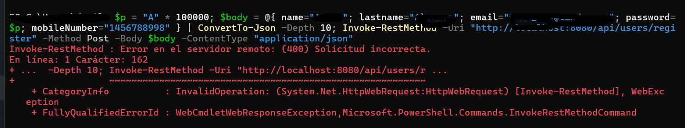
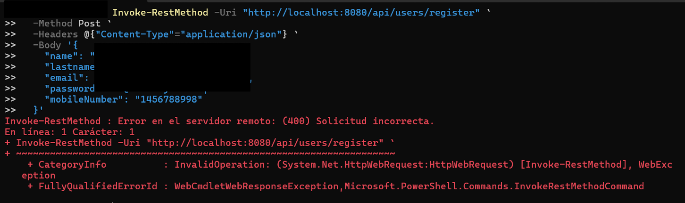
A script was executed from the CMD terminal using an existing username and password.

#### Test Results
2026-06-27T19:05:18.118-06:00  INFO 10716 --- [MfaMailThread-1] .p.p.c.UserRegistrationProcessingService : REGISTRATION SECURITY: Alert email sent successfully to: My_email_here@gmail.com

#### CPU Exhaustion Test Report: Register

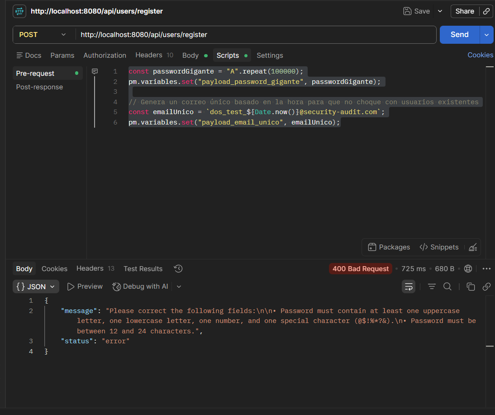

The registration endpoint's resilience against resource exhaustion attacks was evaluated by sending a payload containing a massive password string (100,000 characters).
The objective was to force the system to process an oversized string within the cryptographic hashing algorithm to drive CPU utilization up to 100% (Denial of Service).

Plaintext
2026-06-27T19:52:39.693-06:00  WARN 2248 --- [nio-8080-exec-2] .p.p.c.UserRegistrationProcessingService : REGISTRATION: the result contains validation errors.

#### 3.- USER ENUMERATION TEST REPORT: REGISTER 

Perimeter Rate Limiting: Built-in protection utilizing Bucket4j and Memurai/Redis to effectively block rapid, automated enumeration attempts.
Response Masking & Out-of-Band Alerting: Internal business logic designed to camouflage the server's response when a duplicate email is detected, preventing information leakage.

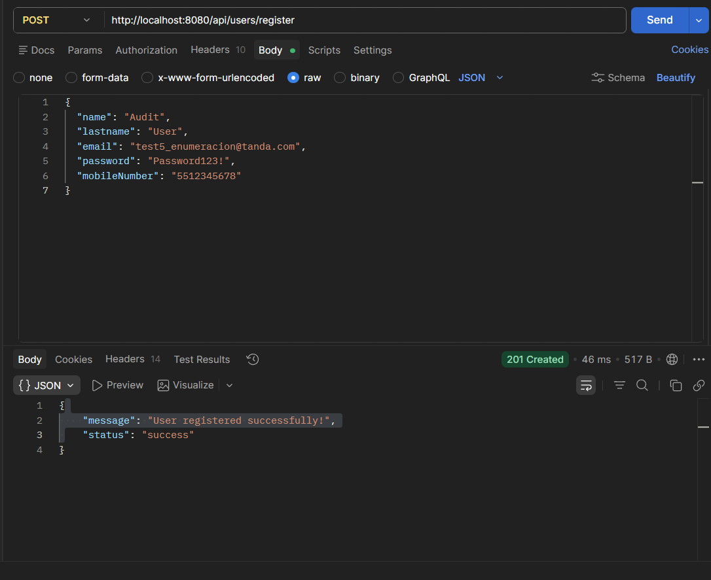

2026-06-27T20:48:36.530-06:00  INFO 17772 --- [MfaMailThread-1] .p.p.c.UserRegistrationProcessingService : REGISTRATION SECURITY: Alert email sent successfully to: test5_enumeracion@tanda.com

#### 4. INFORMATION DISCLOSURE BY STACKTRACE TEST REPORT: REGISTER

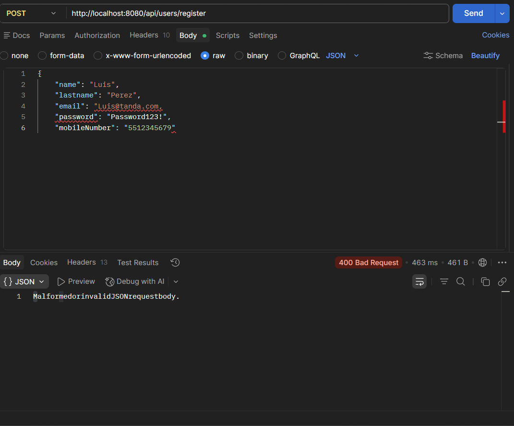
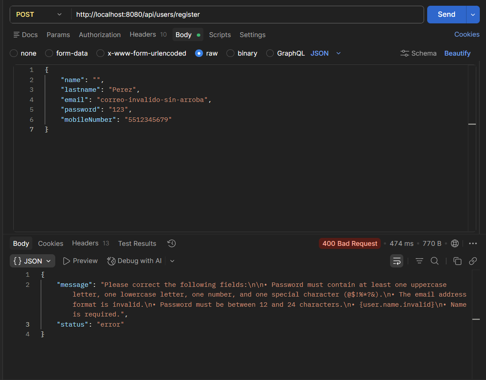
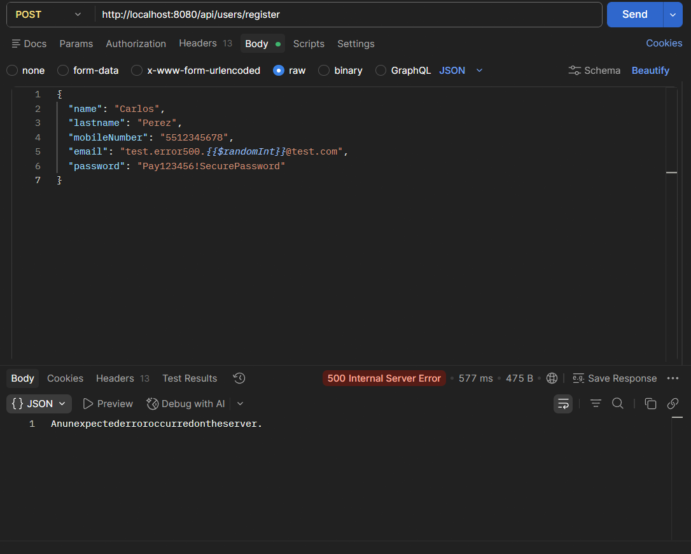

The global exception shield functions correctly. The client only receives a generic, secure error message, while the explicit technical details remain safely stored internally within the server logs.

#### Test Results
2026-06-29T12:26:21.460-06:00  WARN 13116 --- [nio-8080-exec-3] c.p.p.controller.GlobalExceptionHandler  : MALFORMED JSON: Request blocked due to unreadable HTTP message body. Technical reason: JSON parse error: Illegal unquoted character ((CTRL-CHAR, code 13)): has to be escaped using backslash to be included in string value
2026-06-29T14:10:00.467-06:00 ERROR 7144 --- [nio-8080-exec-2] c.p.p.controller.GlobalExceptionHandler  : CRITICAL ERROR: [NullPointerException] - Uncaught exception handled. Technical reason: Cannot invoke "String.toUpperCase()" because "provocarErrorGlobal" is null

#### 5.- DESERIALIZATION & STORED XSS TEST REPORT: REGISTER

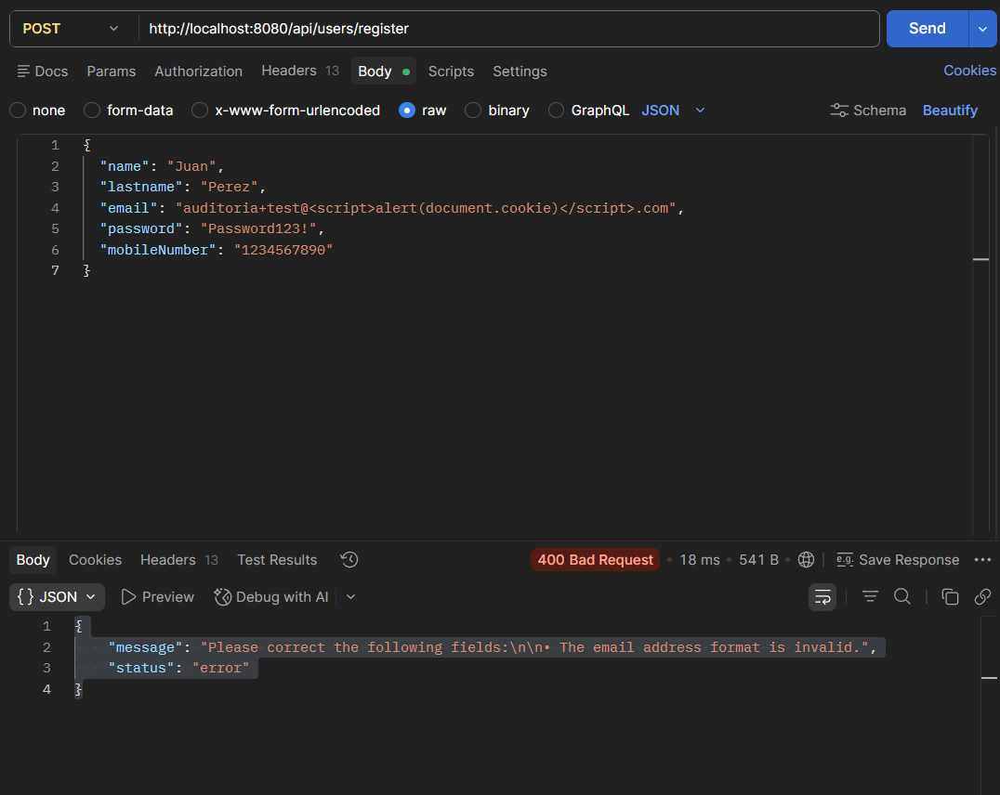
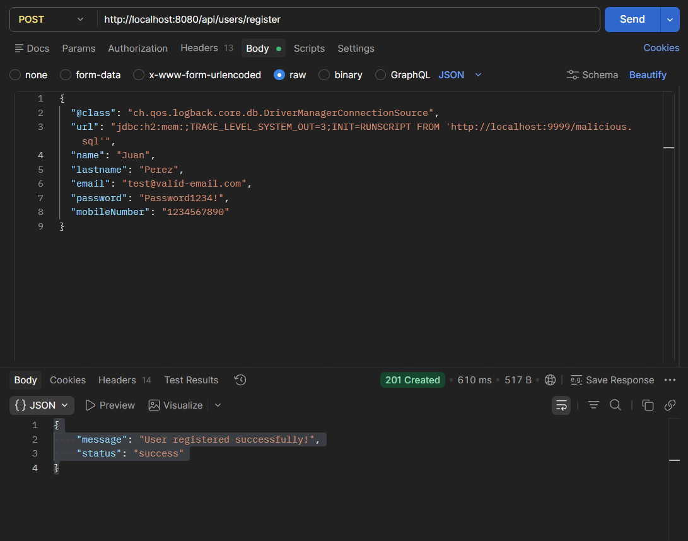

Stored XSS Vector: A malicious script `` was embedded into the `email` field domain to check if the persistence layer stores and the frontend executes unsanitized scripts.
Insecure Deserialization Vector: A polymorphic class gadget (`@class`) specifying an external JDBC connection source was injected into the JSON root to force the Jackson object mapper into executing Remote Code Execution (RCE) or arbitrary class instantiation.

#### Test Results
2026-06-29T18:06:40.742-06:00  WARN 13820 --- [nio-8080-exec-7] .p.p.c.UserRegistrationProcessingService : REGISTRATION: the result contains validation errors.
2026-06-29T17:54:41.738-06:00  INFO 13820 --- [nio-8080-exec-4] .p.p.c.UserRegistrationProcessingService : REGISTRATION SUCCESS: New user registered with email: test@valid-email.com

#### 6.- MASS ASSIGNMENT (PRIVILEGE ESCALATION) TEST REPORT: REGISTER

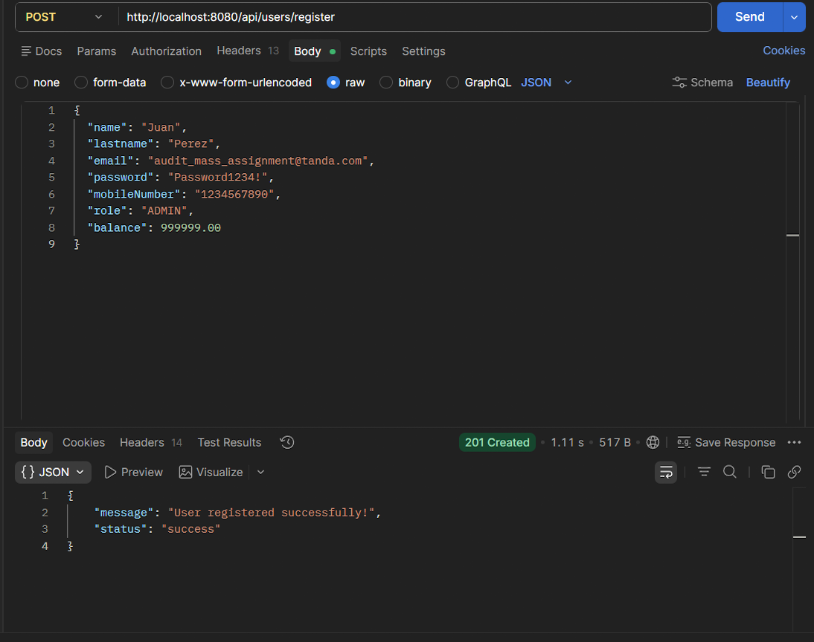

The registration endpoint's resilience against Mass Assignment / Parameter Binding vulnerabilities was evaluated. The objective was to determine if an unauthenticated client could inject unauthorized administrative or financial attributes into the JSON payload to alter the account's state during creation.
Two unauthorized parameters were injected into the request body:
"role": "ADMIN": Attempting to bypass the default access control layer.
"balance": 999999.00: Attempting to seed an arbitrary monetary balance.

#### Test Results
The application utilizes a strict Data Transfer Object (`UserRegistrationDto`) to handle incoming payloads. Because the injected parameters (`role` and `balance`) are not explicitly defined as fields in the Java DTO class, the Jackson Object Mapper automatically dropped them before passing the object to the service layer.
2026-06-29T18:15:47.046-06:00  INFO 4372 --- [nio-8080-exec-2] .p.p.c.UserRegistrationProcessingService : REGISTRATION SUCCESS: New user registered with email: audit_mass_assignment@tanda.com

#### 7.- CORS TEST REPORT: REGISTER 

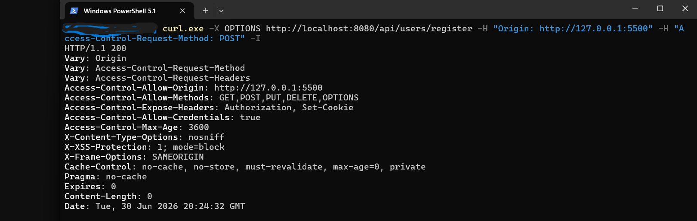
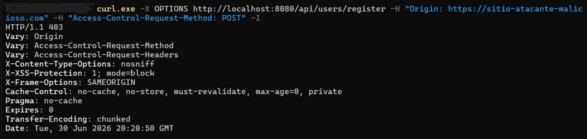

### Test Results
Case A: cURL request executed from the authorized origin (Same-Origin / Trusted Origin). $\rightarrow$ ALLOWED
Case B: cURL request executed from an unauthorized external origin (Cross-Origin / Different Origin). $\rightarrow$ BLOCKED

#### 8.- CSRF VULNERABILITY TEST REPORT: REGISTER
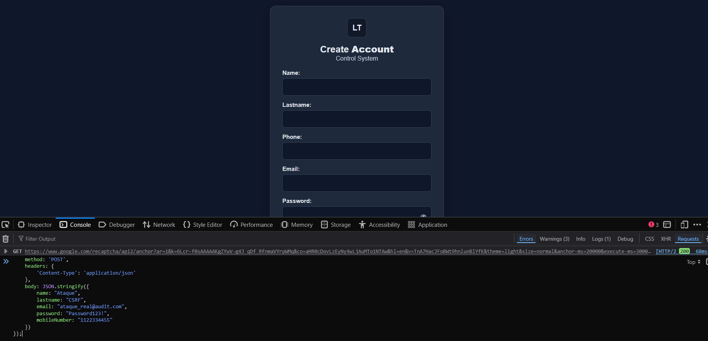

To verify the endpoint's perimeter defense under a forced exploitation scenario, a Cross-Site Request Forgery (CSRF) attack vector was executed via a raw cross-origin fetch injection. This execution directly bypassed the user interface and anti-automation controls.
The backend server successfully detected, evaluated, and terminated the malicious payload. The following sequential runtime logs capture the exact lifecycle of the intercepted attack:

2026-06-30T15:20:36.260-06:00  WARN 9984 --- [nio-8080-exec-1] o.a.c.util.SessionIdGeneratorBase        : Creation of SecureRandom instance for session ID generation using [SHA1PRNG] took [136] milliseconds.
2026-06-30T15:20:36.266-06:00 DEBUG 9984 --- [nio-8080-exec-1] o.s.s.w.s.HttpSessionEventPublisher      : Publishing event: org.springframework.security.web.session.HttpSessionCreatedEvent[source=org.apache.catalina.session.StandardSessionFacade@520c9272]
2026-06-30T15:20:36.268-06:00 DEBUG 9984 --- [nio-8080-exec-1] o.s.security.web.csrf.CsrfFilter         : Invalid CSRF token found for http://localhost:8080/api/users/register

#### 9.- SpEL TEST REPORT: REGISTER

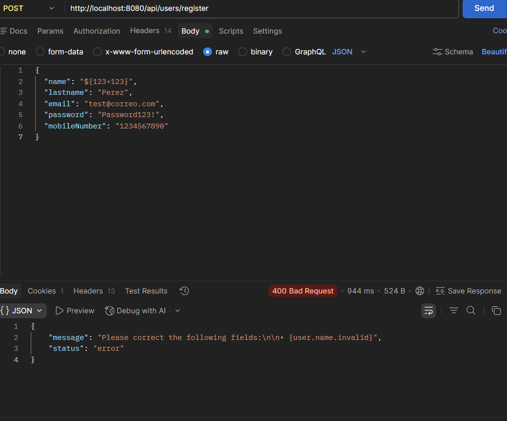

Test Method

Injected the payload ${123+123} into the structured input fields.
Test Results
SECURE (Not Vulnerable). The backend does not evaluate dynamic expressions within the DTO argument validation layer; it handles error messages strictly through static/textual interpolation.

#### Test Results
2026-06-30T15:51:52.960-06:00  WARN 7376 --- [nio-8080-exec-2] .p.p.c.UserRegistrationProcessingService : REGISTRATION: the result contains validation errors.

#### 10. TIMING ATTACK TEST REPORT: REGISTER

BEFORE MITIGATION (Vulnerable)
Scenario A: New User Registration (Non-existent Email)
Total Response Time: 566.94 ms
Server Processing Time (TTFB): 561.78 ms
Scenario B: Duplicate User Rejection (Existing Email)
Total Response Time: 45.01 ms
Server Processing Time (TTFB): 36.86 ms

AFTER MITIGATION (Secure)
Scenario A: New User Registration (Non-existent Email)
Total Response Time: 387.00 ms
Server Processing Time (TTFB): 387.00 ms
Scenario B: Duplicate User Rejection (Existing Email)
Total Response Time: 354.00 ms
Server Processing Time (TTFB): 354.00 ms

#### 11.- EMAIL SUB-ADDRESSING & ALIAS EXPLOITATION TEST REPORT: REGISTER

Two distinct attack vectors were analyzed to measure the application's resilience against email constraint bypasses:
Plus Sign Alias (+): Injecting characters after a plus sign (e.g., user+attack@gmail.com) to bypass uniqueness constraints while routing to the same inbox.
Dot Trick (.): Shifting period placements (e.g., u.s.e.r@gmail.com) to trick string comparisons on dot-insensitive email providers.

#### Test Results
2026-07-01T13:51:23.266-06:00  INFO 7996 --- [MfaMailThread-1] .p.p.c.UserRegistrationProcessingService : REGISTRATION SECURITY: Alert email sent successfully to: auditoriatest@gmail.com

#### 12. IMPACT ANALYSIS AND MITIGATION: ReDoS IN REGISTRATION ENDPOINT

Detected Vulnerability: Use of inefficient regular expressions (^[A-Za-z0-9+_.-]+@(.+)$) within the validation annotation for the email field, making it susceptible to Catastrophic Backtracking when subjected to inflated, malicious payloads.
Mitigation Action Performed:

Removed the implicit dependency on inefficient validators.
Implemented a linear and deterministic regular expression using: 
@Pattern(regexp = "^[A-Za-z0-9+_.-]+@[A-Za-z0-9-]+(\\.[A-Za-z0-9-]+)*\\.[A-Za-z]{2,}$")

Introduced a defense-in-depth measure by limiting the input size at the DTO level using @Size(max = 254).

Empirical Stress Testing Results (Local Benchmark):
Original Code: A malformed payload of 25,000 characters degraded the response time to ~677ms, causing CPU spikes due to backtracking.
Mitigated Code: A massive malformed payload of 200,000 characters (8x larger) is processed in a linear and secure manner in ~651ms, successfully mitigating service degradation and stabilizing CPU consumption.

Status: RESOLVED / COMPLIANT