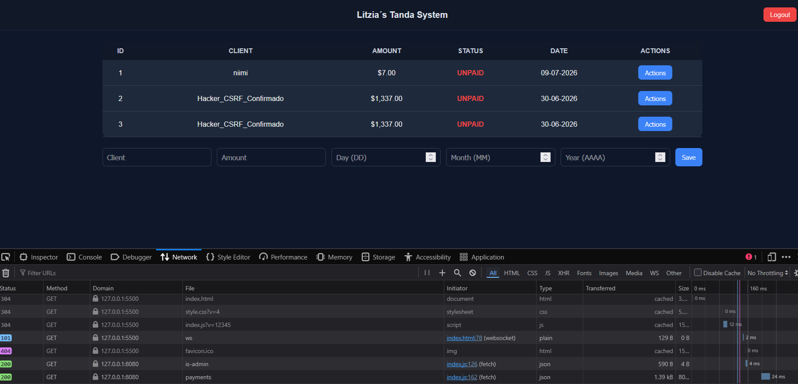
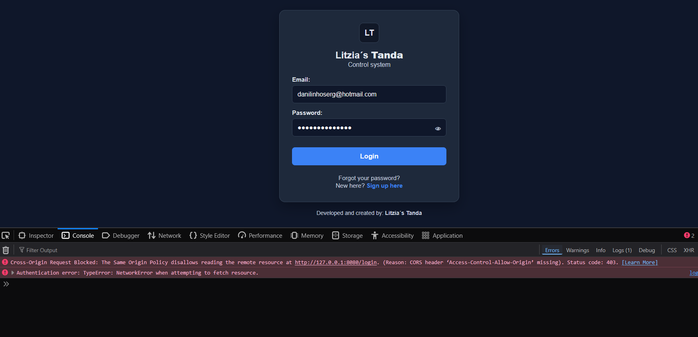

#### 1.- CSRF ATTACK REPORT: INDEX 

Two distinct scenarios were analyzed to measure the application's behavior under attack:
Scenario 1 (Bypassed Defenses): The CSRF defense was disabled, allowing the attacker's script to exploit the active session cookie and successfully insert the unauthorized payment "Hacker_CSRF_Confirmado" (ID 3) into the database.
Scenario 2 (Active Defenses): The native CSRF protection and reCAPTCHA were fully active, forcing Spring Security to intercept and block the malicious request with an HTTP 403 Forbidden error before it could modify the database.

#### Test Results
INFO  [nio-8080-exec-7] c.p.p.controller.PaymentController : Payment created successfully with ID 3
2026-06-30T12:40:51.918-06:00  INFO 3988 --- [nio-8080-exec-7] c.p.p.controller.PaymentController       : Fetching all payments

#### 2.- CORS ATTACK REPORT: INDEX 

Scenario 1 (Unrestricted CORS): The frontend origin http://127.0.0.1:5500 was explicitly trusted with credentials enabled, allowing cross-origin scripts to access and read response payloads from the API.
Scenario 2 (Restricted CORS): The origin http://127.0.0.1:5500 was stripped from the allowed list, forcing the browser to drop the connection and throw a NetworkError due to a missing Access-Control-Allow-Origin header.